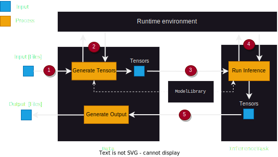

# Deep learning on the web

This repository contains the source code for the `dl.on.web.js` platform for federated learning on the browser.

# Links
- Web app:   https://dlonweb.netlify.app/
- Documentation and project details :  https://shubhvjain.github.io/dlonweb/

## How to use the app ?

### Option 1 : Use the hosted app : 
- Simply go to  [https://dlonweb.netlify.app](https://dlonweb.netlify.app)  
- Upload your input, select a model and get the output - as simple as that!
  
### Option 2 : Host you own version 
- You can easily do that as well or just run it on your local machine 
- We provide a docker file for easy build and deployment of all app components

### Optional backend support

Due to resource constraints on the browser, we also provide a standalone backend service accessible via HTTP. It enables additional functionalities like converting Keras models for browser compatible inference

## Overall Inference Pipeline 

## Project architecture

### Folder structure

The project is divided into 3 main sub folders. 

#### `package`
The shared JS npm package with core abstract base classes that define the framework for loading data , training the model and performing an inference task. It is used as a local dependency in the frontend and backend packages and enables consistent behavior across the browser and server environment. It is integrated using dependency injection allowing frontend and backend to plug in platform specific dependencies  to avoid duplicate logic. For instance, using `@tensorflow/tfjs` package in the frontend and `@tensorflow/tfjs-node` in the backend to use Tensorflow. 

#### `frontend`
 Web-based user interface. The main app. Build using the `Svelte` framework.  

#### `backend`
 Node.js backend with Python (Poetry) components. An additional standalone service that can increase the power of the frontend. Needs to be run on a local port and is accessed via http from the frontend.

Additional files in the root folder: 

- `install.sh` :  Script to install all dependencies

## Links to documentation for each component of the project:
- [Frontend](./frontend/README.md)
- [Backend](./backend/README.md)
- [Package](./package/README.md)

## Installation 

Step to get the system running locally:

- **Clone the repository** : `git clone https://github.com/shubhvjain/dlonweb1.git dlonweb` 
- `cd dlonweb`
- **Install all required dependencies**: There are 2 possible options here.
  - Install all dependencies at once using `install.sh` script. Run `./install.sh` from the root of the project
  - Individual components installations:
    - `package` : `cd package && npm install`
    - `frontend` : `cd frontend && npm install`
    - `backend` : `cd backend && npm install`. additionally, backend also depends on python, which m
- This can be done by installing each package individually. Or run `install.sh` script which will install all dependencies 

## Development 

### Git workflow 

- All current development happens on the `main` branch 
- The current release version is on the `release` branch
- For new development, create a feature branch from `main` and create a PR to `main`
- To release a new version : create a PR from `main`  to `release`

