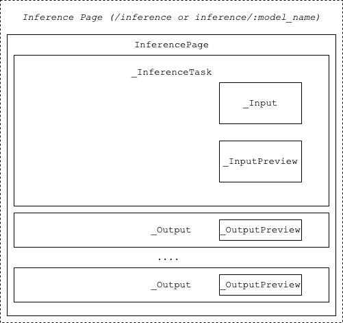

# Frontend for DL on the web

This is the fronted application for DL on the web , build using [Svelte]( https://svelte.dev/docs/svelte/overview) and  [SvelteKit](https://svelte.dev/docs/kit/introduction)


## Getting started 

- Clone the main repo (since the `frontend` package depends on the `package`)
- `cd frontend` 
- Install all the required package `npm install`
- To run the app locally `npm run dev -- --open` (The --open flag automatically opens the app in your browser.)

## Manual Building 

- To create a production version of the app manually : `npm run build`
- You can preview the production build with `npm run preview`.

## Multilingual support  

 (using translations files with same keys )

To use multilingual labels in any component 

### Using Translations in a Component
```
<script>
  import { translations } from '$lib/store.js';
</script>

<p>{$translations.inference}</p>
```

### Managing translations 
- Translation files are located in the static/locales folder.
- When adding a new label, update it in all language files to maintain consistency. 


## Project structure 

(not up to date #TODO)

```
frontend/
├── src/
│   ├── routes/          # App pages (SvelteKit file-based routing)
│   │   ├── +page.svelte # Main entry point for each route
│   │   ├── +layout.svelte # Layout wrappers for nested routes
│   │   └── about/         # About page
|   |   └── settings/      # Settings page 
|   |   └── convert/       # Page to convert .h5 models to tensorflow.js compatible
|   |   └── inference/     # Page to run prediction 
|   |   └── training/      # Page to run model training 
│   │
│   ├── lib/             # Shared utilities and modules
│   │   ├── components/  # Reusable UI components
│   │   ├── store.js     # Svelte stores (e.g., translations, state)
│   │   └── utils/       # Helper components
│   │
│   └── app.html         # Root HTML template
│
├── static/              # Static assets (images, translations, etc.)
│   └── locales/         # Translation files for multilingual support
│
├── package.json
└── ...
```


## Routes and components 


### Inference page 




